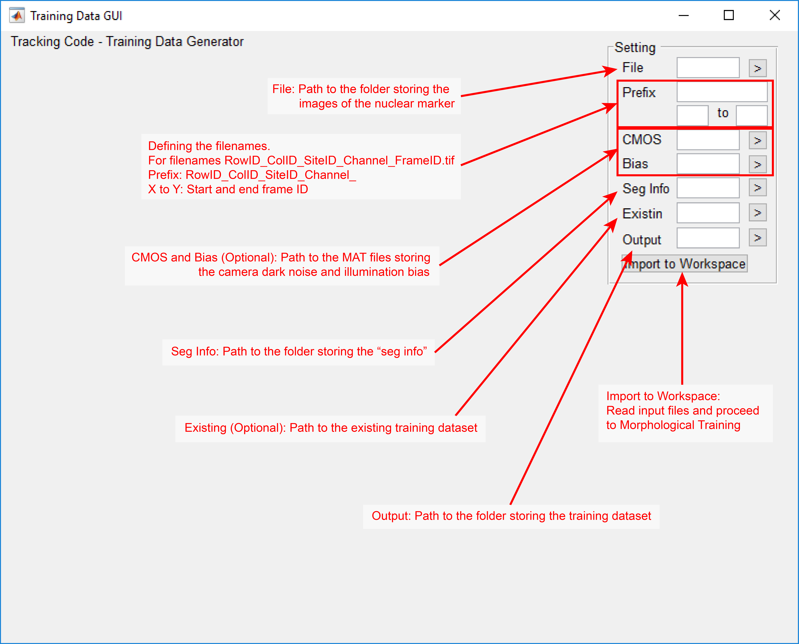
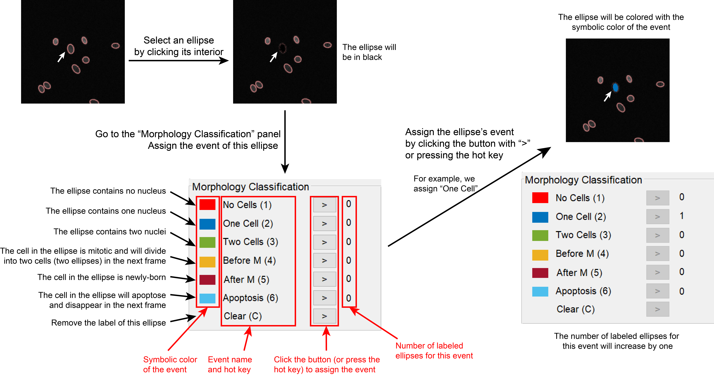
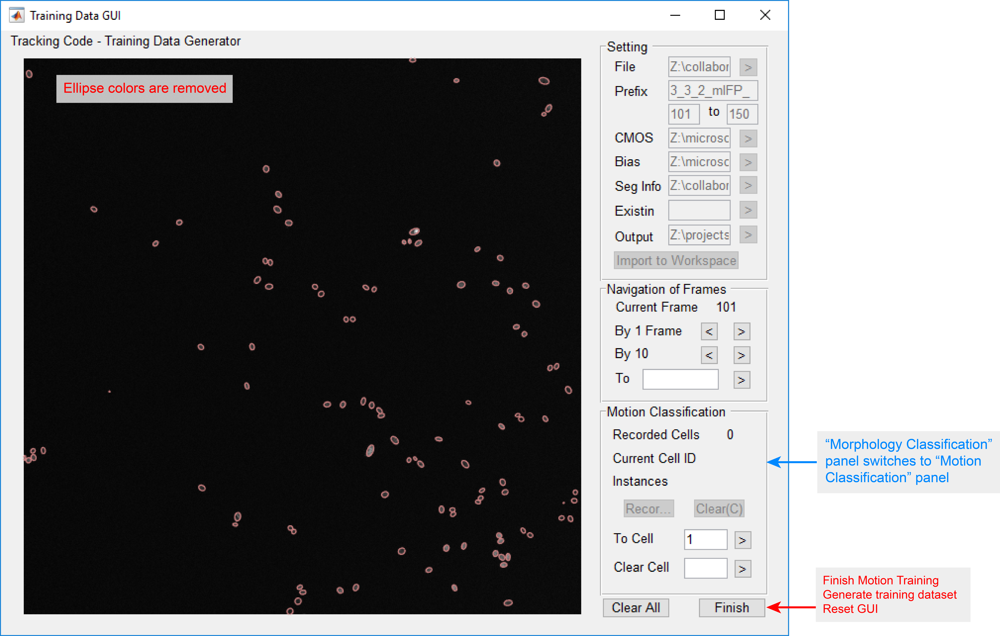
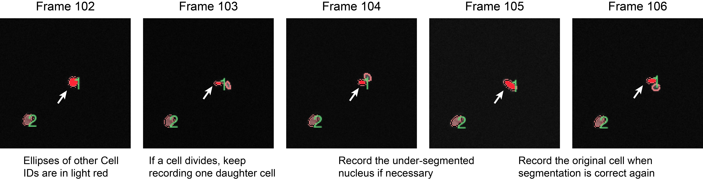
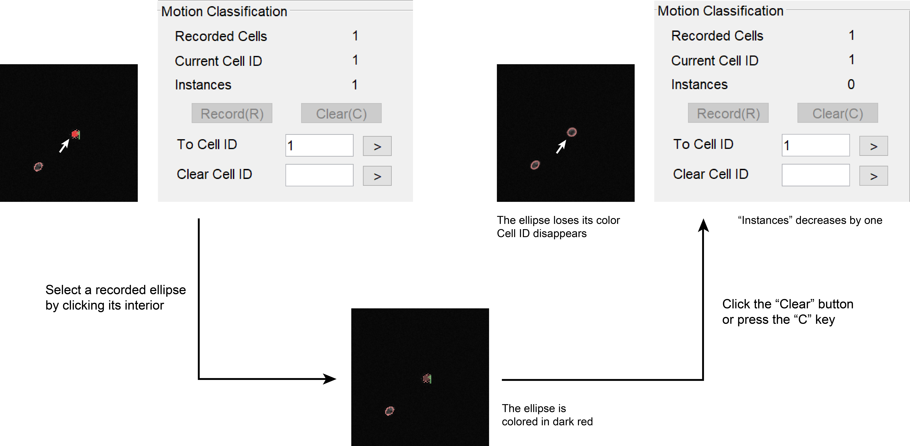

.. include:: .special.rst

.. _GUI_training_Page:

=======================
Training Data Generator
=======================

Input Files
***********

Training Data Generator GUI requires the following files

*  **Images of the nuclear channel**. TIFF format only. Filenames should follow the format *RowID_ColumnID_SiteID_Channel_FrameID.tif*.
*  **Camera dark noise (CMOS Offset)**. Optional.
*  **Illumination bias (Bias) of the nuclear channel**. Optional.
*  **"Seg Info"**. Generated by setting :reditalic:`if_save_seg_info` in *segmentation_para* to one. Refer to :ref:`parameters_segmentation_nonspecific` of :ref:`parameters_segmentation_Page`.
*  **Existing training dataset**. Optional. An existing training dataset can be loaded for further edit.

Opening the GUI
***************

Navigate Matlab to the *GUI* folder and execute ``training_data_gui`` in the command window.

"Setting" Panel
***************

.. _training_initial_interface:

   
   Initial interface.

.. admonition:: Remark

   Zoom in the image by opening it in a new window.

The initial interface is shown in :numref:`training_initial_interface`.
The locations of the input files should be specified in the "Setting" panel as follows.

*  **File**. Path to the folder storing the images of the nuclear channel.
*  **Prefix**. Specifying the files of interest. 

   For images with filenames *RowID_ColumnID_SiteID_Channel_FrameID.tif*, 
   "Prefix" should be filled with *RowID_ColumnID_SiteID_Channel_* (remember the *_* in the end)
   and the two text boxes in the following line should be filled with the starting and end Frame IDs.

*  **CMOS**. Path to the MAT file storing the camera dark noise. Leave empty if not provided.
*  **Bias**. Path to the MAT file storing the illumination bias of the nuclear channel. Leave empty if not provided.
*  **Seg Info**. Path to the folder storing the "Seg Info" of the images.
*  **Existing**. Path to the existing training dataset. Leave empty if not provided.
*  **Output**. Path to the folder storing the generated training dataset.

.. admonition:: Remark

   As with Parameter Generator GUI, to specify a path (with entries like |box_arrow_training|), either type the path in the text box or click ">" and manually select the file/folder with a system dialog.

.. admonition:: Example
   :class: hint
   
   A movie is captured in Site 3 of Well A02, and the channel for the nuclear marker is *CFP*.
   The images are located in the folder ``X:/tracking_code/raw_images/``;
   camera dark noise is stored in ``X:/tracking_code/mat_files/cmosoffset.mat``;  
   illumination bias of the *CFP* channel is stored in ``X:/tracking_code/mat_files/CFP.mat``; 
   and the "Seg Info" of the images are located in the folder ``X:/tracking_code/seg_info/``.
   To create a new training dataset (no existing dataset is available) from Frame 101 to 200 and save it in the folder
   ``X:/tracking_code/mat_files/``, enter the following information in the "Setting" panel.

   *  **File**. ``X:/tracking_code/raw_images/``. This folder should contains images from *1_2_3_CFP_101.tif* to *1_2_3_CFP_200.tif*.
   *  **Prefix**. Type *1_2_3_CFP_* in the current line. Type *101* and *200* in the next line.
   *  **CMOS**. ``X:/tracking_code/mat_files/cmosoffset.mat``.
   *  **Bias**. ``X:/tracking_code/mat_files/CFP.mat``.
   *  **Seg Info**. ``X:/tracking_code/seg_info/``. This folder should contains the "Seg Info" files from *1_2_3_CFP_101_segmentation.mat* to *1_2_3_CFP_200_segmentation.mat*.
   *  **Existing**. Leave empty.
   *  **Output**. ``X:/tracking_code/mat_files/``

After providing all the information, click "Import to Workspace" to proceed. GUI will load all the input files into the workspace. This process may take a few minutes. Refrain from clicking the button multiple times.

Morphological Training
**********************

GUI Interface
=============

.. _training_morphology:

.. figure:: _static/images/training/3.png
   :align: center
   
   Interface for Morphological Training.

The interface for Morphological Training is shown in :numref:`training_morphology`. 
The "Setting" panel is now disabled and multiple new panels appear.

Left Panel
  Display the current image. Fitted ellipses are overlaid on the top.

  .. admonition:: Remark

     The pixel intensities are auto-scaled by applying the Matlab function *mat2gray* to every image.
     It is possible that a pixel has the same intensity in two images but appears with different brightness.
     Training datasets are not affected by this auto-scaling.

Navigation of Frames
  Nagivate the image in display. 

  *  **Current Image**. Frame ID of the image in display.
  *  **By 1 Frame**. Go forward (click ">" or press the right arrow key) or backward (click "<" or press the left arrow key) by 1 frame.
  *  **By 10 Frame**. Go forward (click ">" or press the down arrow key) or backward (click "<" or press the up arrow key) by 10 frames.

     .. admonition:: Remark

        Images are navigated circularly. For example, the previous image of the first image of the sequence is the last image.

  *  **To**. Go to an arbitrary frame. Type the Frame ID in the text box and click ">".

Morphology Classification
  Assign morphological events to ellipses. Refer to :ref:`gui_training_morphology_label`.
  
Buttons
  The "Clear All" button clears all existing training samples, including samples for both Morphological Training and Motion Training.

  The "Next" button ends Morphological Training and proceeds to Motion Training.
  
.. _gui_training_morphology_label:

Assign Events
=============

.. _training_morphology_assign:

   
   Procedure for assigning an event.

To assign an event, click the ellipse of interest and this ellipse will be colored in black.
Go to the "Morphology Classification" panel and assign an event to this ellipse by either clicking the ">" button or by pressing the hot key.
The ellipse will then be colored in the symbolic color of this event, and the number of labeled ellipses for this event will increase by one as well.
This procedure is summarized in :numref:`training_morphology_assign`.

Refer to :ref:`parameters_track_linking_terminology` of :ref:`parameters_track_linking_Page` for event descriptions.

.. admonition:: Remark

   If a wrong ellipse is selected, click any other ellipse or navigate to other frames to undo the selection.
   No training samples of the wrong ellipse will be created.

Correct and Remove Events
=========================

.. _training_morphology_correct:

.. figure:: _static/images/training/3b.png
   :align: center

   Procedure for correcting and removing an event.

To correct an event, click the ellipse of interest and the ellipse will be colored in black.
Go to the "Morphological Classification" panel and assign a new event.
The ellipse will then be colored in the symbolic color of the new event. 
The numbers of labeled ellipses for both the old and the new events will be adjusted.

To remove an event, click the ellipse of interest and the ellipse will be colored in black.
Go to the "Morphological Classification" panel and click the ">" button for "Clear" (or press the hot key *C*).
The ellipse will lose its color, and the number of labeled ellipses for the event will decrease by one.
These procedures are summarized in :numref:`training_morphology_correct`.

Click "Next" to switch to Motion Training. At least one training sample (can be any event) should be created before proceeding.

Motion Training
***************

GUI Interface
=============

.. _training_motion:

   
   Interface for Motion Training.

The interface for Motion Training is shown in :numref:`training_motion`.
The "Morphology Classification" panel is replaced by the "Motion Classification" panel (refer to :ref:`GUI_training_motion_record`).
The "Next" button is replaced by the "Finish" button, which ends Motion Training, saves the training dataset, and resets the GUI.

.. _GUI_training_motion_record:

Record Cells
============

The objective of Motion Training is to record all ellipses of a cell in the image sequence.
Each recorded cell is assigned with a numeric ID (called Cell ID), and each recorded ellipse of a cell is called an "Instance" of the Cell ID.
In the "Motion Classification" panel, **Recorded Cells** shows how many cells have been recorded, 
**Current Cell ID** shows the Cell ID being recorded, and **Instances** shows how many ellipses have been recorded for the current Cell ID.

.. _training_motion_record:

.. figure:: _static/images/training/4a.png
   :align: center

   Procedure for recording a cell.

To create a new Cell ID or to switch to an existing one, type the Cell ID next to **To Cell ID** and click ">".
This Cell ID will then be created (if not yet) and displayed next to "Current Cell ID".

To record an ellipse, click an ellipse of interest and it will be colored in dark red.
Go to the "Motion Classification" panel and click the "Record" button (or press the hot key *R*).
This ellipse will then be colored in red and its Cell ID will be displayed next to it. The number of Instances will increase by one.
This procedure is summarized in :numref:`training_motion_record`.

.. _training_motion_multiple:

   Example images with multiple Cell IDs.

The recorded ellipses of the current Cell ID will be colored in red, and other recorded ellipses will be colored in light red, as shown in :numref:`training_motion_multiple`.

.. admonition:: Remark

   Ideally, cells should be recorded at every frame. 
   If a cell divides, continue recording one of its daughters. 
   If a cell is under- or over-segmented, record the under-segmented ellipse or one of the over-segmented ellipses.
   Do not record any ellipse if a cell is undetected.

Remove Recording
================

.. _training_motion_remove:

   Procedure for removing an ellipse.

To remove a recorded ellipse, click the ellipse of interest and the ellipse is colored in dark red.
Go to the "Motion Classification" panel and click the "Clear" button (or press the hot key *C*). 
The ellipse will then lose its color, and the number of "Instances" will decrease by one.
This procedure is summarized in :numref:`training_motion_remove`.

To remove all recorded ellipses of a Cell ID, type the ID in the text box next to **Clear Cell ID** and click ">".
All ellipses of this Cell ID will be removed, though this Cell ID will continue to exist. 

Click "Finish" to generate the training dataset and reset the GUI. At least two cells and at least three ellipses per cell should be recorded before proceeding.

.. |box_arrow_training| image:: _static/images/training/box_arrow.png
