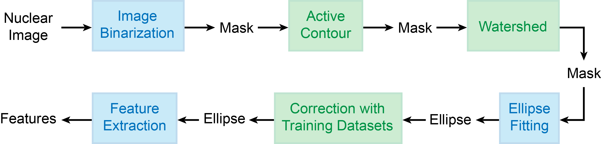

.. include:: .special.rst

.. _parameters_segmentation_Page:

============
Segmentation
============

Overview
********

Segmentation consists of multiple steps.
As illustrated in :numref:`para_segmentation`, images of the nuclear marker are first binarized in Image Binarization.
The resulting binary images, called "mask", are then optimized by Active Contour and Watershed.
Nuclear contours in the mask are then fitted by ellipses in Ellipse Fitting.
Finally, segmentation mistakes are corrected in Correction with Training Datasets and features are extracted from each ellipse in Feature Extraction.

Within the pipeline, Image Binarization, Ellipse Fitting, and Feature Extraction (blue) are required, while other steps (green) are optional. 

.. _para_segmentation:

   Schematic diagram of Segmentation.

For clarity, *segmentation_para* is divided into multiple lower-level Matlab structures, where each structure contains the parameters for one Segmentation step.
Five lower-level structures are available:

*  *image_binarization_para*. Parameters for Image Binarization.
*  *active_contour_para*. Parameters for Active Contour.
*  *watershed_para*. Parameters for Watershed.
*  *ellipse_para*. Parameters for Ellipse Fitting.
*  *seg_correction_para*. Parameters for Correction with Training Datasets.

In addition, *segmentation_para* contains parameters not specific to any steps ("non-specific parameters"). 

.. _parameters_segmentation_nonspecific:

Non-Specific Parameters
***********************

*  :greenitalic:`if_active_contour`. Indicator variable of whether to run Active Contour.
*  :greenitalic:`if_watershed`. Indicator variable of whether to run Watershed.
*  :greenitalic:`if_seg_correction`. Indicator variable of whether to run Correction with Training Datasets.

   Parameters specific to nonexecuted steps do not affect the tracking performance.

*  :reditalic:`if_print_mask`. Indicator variable of whether to generate the mask before Ellipse Fitting.
*  :reditalic:`mask_path`. Path to the folder storing the masks.
*  :reditalic:`if_print_ellipse_movie`. Indicator variable of whether to generate "Ellipse Movie" where fitted ellipses are overlaid on the nuclear images (similar to Figure 1F).
*  :reditalic:`ellipse_movie_path`. Path to the folder storing the "Ellipse Movies".
*  :reditalic:`if_save_seg_info`. Indicator variable of whether to save the features of ellipses in each frame ("seg info").  
*  :reditalic:`seg_info_path`. Path to the folder storing the "seg info".

   "Seg Info" files are required for Training Data Generator GUI.

*  :greenitalic:`nuc_radius`. Average radius (in pixels) of a nucleus.
*  :greenitalic:`max_hole_size_for_fill`. Maximal area (in pixels) of a hole to fill in.
*  :greenitalic:`min_component_size_for_nucleus`. Minimal area (in pixels) of a component to contain a nucleus.

   A component is defined as a set of connected foreground pixels (value = 1) in the mask, and a hole is defined as a set of connected background pixels (value = 0) within a component.
   Holes smaller than or equal to :greenitalic:`max_hole_size_for_fill` and components smaller than :greenitalic:`min_component_size_for_nucleus` will be removed.

.. _parameters_segmentation_image_binarization:

Image Binarization
******************

EllipTrack provides two methods of Image Binarization and Blob Detection (controlled by :reditalic:`if_blob_detection`).

Thresholding
  Images of the nuclear marker ("raw images") are first smoothed by the Matlab function *imfilter* with a disk of radius :greenitalic:`blurradius`. 
  After an optional log-transform (controlled by :reditalic:`if_log`), images are then auto-scaled with the Matlab function *mat2gray* and binarized by the Matlab function *imbinarize*.
  Finally, small components and small holes are removed from the mask.

Blob Detection
  Raw images are log-transformed (optional step, controlled by :reditalic:`if_log`) and sharpened. 
  The spatial second-order derivative of the images (Hessian) are then computed and a global threshold :blueitalic:`blob_threshold` is applied to the Hessian to binarize the images.
  Finally, small components and small holes are removed from the mask.
    
*  :greenitalic:`blurradius`. Both methods. Radius (in pixels) of disk for smoothing.
*  :reditalic:`if_log`. Both methods. Indicator variable of whether to log-transform the images.

   Not to be confused with the namesake in :ref:`parameters_segmentation_active_contour`.

*  :reditalic:`if_blob_detection`. Both methods. Indicator variable of whether to run Blob Detection.
*  :blueitalic:`blob_threshold`. Blob Detection only. Threshold of Hessian.

.. _parameters_segmentation_active_contour:

Active Contour
**************

Active Contour (a.k.a. "Snake") is an image processing algorithm to identify object outlines from a noisy background.
The algorithm takes two inputs - a raw image and its mask - and outputs an optimized mask by modifying the shape of components with the pixel intensities in the raw image.

In EllipTrack, raw images are log-transformed (optional step, controlled by :reditalic:`if_log`) and auto-scaled.
Raw images and their masks are then processed by the Active Contour algorithm to generate the optimized masks. 
EllipTrack provides two methods of Active Contour: Global and Local (controlled by :reditalic:`if_global`)

Global
  Active Contour is applied to the entire image.

Local
  Actice Contour is applied to the local neighborhood of every component. Optimized masks from local neighborhoods are then assembled.
  
Finally, EllipTrack smoothes the mask with the Matlab function *imfilter* with a disk of radius :greenitalic:`blurradius` and removes small component and small holes from the mask.

*  :greenitalic:`blurradius`. Radius (in pixels) of disk for smoothing.
*  :reditalic:`if_log`. Indicator variable of whether to log-transform the images.

   Not to be confused with the namesake in :ref:`parameters_segmentation_image_binarization`.

*  :reditalic:`if_global`. Indicator variable of whether to run the Global method.

Watershed
*********

Watershed is an image processing algorithm to separate overlapping objects.
In brief, the algorithm mimics a component by a watershed and defines the elevations of pixels by their distances to the image background.
Pixels with local maximal elevations (peaks) are treated as markers, and basins best separating the markers (path of water flow) are used to cut the component.

In EllipTrack, a peak is not defined by a single pixel. 
Instead, it is defined by a set of pixels with area between :greenitalic:`min_thresh_component_size` and :greenitalic:`max_thresh_component_size` obtained by repeatedly eroding the mask.

*  :greenitalic:`max_thresh_component_size`. Maximal area (in pixels) of a peak.
*  :greenitalic:`min_thresh_component_size`. Minimal area (in pixels) of a peak.

Ellipse Fitting
***************

EllipTrack uses a previously published algorithm (Zafari *et al.* 2015) to fit the contours of components by ellipses.
Irregular ellipses, including ellipses with perimeters smaller than :greenitalic:`min_ellipse_perimeter`, area smaller than :greenitalic:`min_ellipse_area`, and major axis greater than :greenitalic:`max_major_axis`, are removed.

*  :greenitalic:`k`, :greenitalic:`thd1`, :greenitalic:`thd2`, :greenitalic:`thdn`, :greenitalic:`C`, :greenitalic:`T_angle`, :greenitalic:`sig`, :greenitalic:`Endpoint`, :greenitalic:`Gap_size`. Parameters in Zafari *et al.* 2015. Refer to the original publication for more information.
*  :greenitalic:`min_ellipse_perimeter`. Minimal perimeter (in pixels) of an ellipse.
*  :greenitalic:`min_ellipse_area`. Minimal area (in pixels) of an ellipse.
*  :greenitalic:`max_major_axis`. Maximal major axis (in pixels) of an ellipse.

.. _parameters_segmentation_correction:

Correction with Training Datasets
*********************************

EllipTrack trains a linear discriminant classifier with user-provided training datasets (specified by :reditalic:`training_data_path`) to predict the number of nuclei in each ellipse.
Ellipses with a high probability of containing no nucleus (greater than :greenitalic:`min_no_cell_prob`) are removed.
Ellipses with a high probability of containing two nuclei (greater than :greenitalic:`min_two_cells_prob`) are split into two with the k-means algorithm.
Since k-means is a stochastic algorithm, to maintain a high confidence of splitting, EllipTrack runs the k-means algorithm twice and only splits the ellipses if the fraction of mismatch between these two runs is less than :greenitalic:`max_fraction_mismatch`.
In addition, ellipses with an area smaller than :greenitalic:`min_ellipse_area_twocells` will not be split.

*  :reditalic:`training_data_path`. Paths to the training datasets.

   To load *n* training datasets, :reditalic:`training_data_path` should be an *n x 1* cell array where each row is a string specifying the path to one training dataset.

   .. admonition:: Examples
      :class: hint 
      
      Two training datasets are available. 
      The first one is located in ``X:/tracking/mat_files/training_data1.mat`` and the second one is located in ``X:/tracking/mat_files/training_data2.mat``.
      To load both datasets into EllipTrack, the value of the parameter should be
 
      .. code-block:: matlab
 
         training_data_path = {'X:/tracking/mat_files/training_data1.mat';
                               'X:/tracking/mat_files/training_data2.mat'};
   
   Not to be confused with the namesake in :ref:`parameters_track_linking_predict` of :ref:`parameters_track_linking_Page`.

*  :greenitalic:`min_ellipse_area_twocells`. Minimal area (in pixels) of an ellipse for splitting.
*  :greenitalic:`max_fraction_mismatch`. Maximal fraction (between 0 and 1) of mismatch between two k-means runs.
*  :greenitalic:`min_no_cell_prob`. Minimal probability (between 0 and 1) of containing no nucleus for removal.
*  :greenitalic:`min_two_cells_prob`. Minimal probability (between 0 and 1) of containing two nuclei for splitting.
