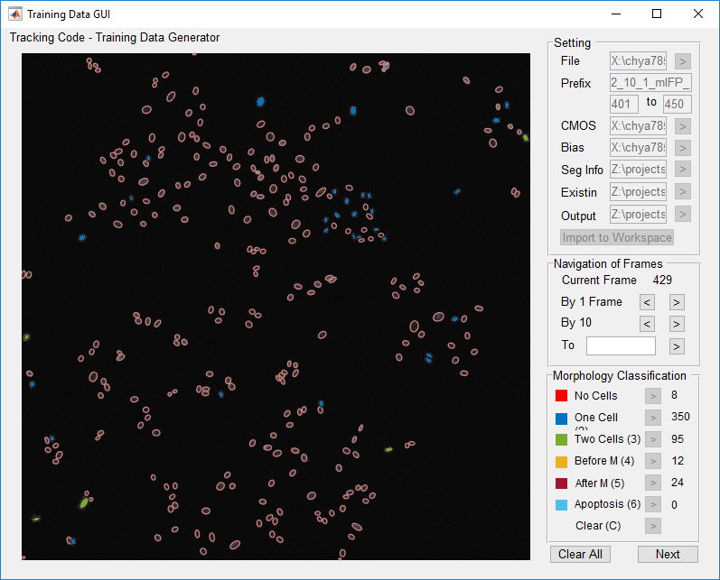
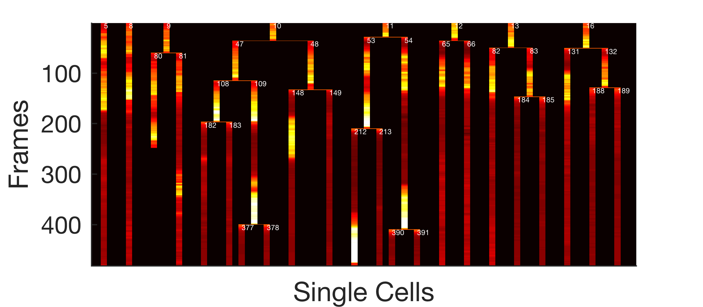

.. include:: .special.rst

.. _Tutorial_Page:

========
Tutorial
========

Dataset
*******

The sample movie for this tutorial is the A375 movie in the manuscript.
In brief, A375 melanoma cancer cells were transduced with H2B-mIFP (nuclear marker), DHB-mCherry (CDK2 sensor), and Fra1-YFP (FIRE sensor).
Cells were then imaged in Site 1 of Well B10 every 15 minutes over five days. The movie length is 482 frames.

Download the dataset `here`_ (around 10 GB). This dataset contains the following folders.

*  *Raw*. Raw images of the movie. TIFF format. 
*  *scripts*. EllipTrack.
*  *mat_files*. MAT files for the camera dark noise and illumination biases. Training datasets.
*  *mask*, *ellipse_movie*, *seg_info*, and *vistrack*. Optional outputs.
*  *results*. Outputs of *mainfile.m*. Heatmaps of cell lineage trees.

.. admonition:: Remark

   Files are stored in the following paths in our local computer.
   
   *  **Raw Images**. 
     
      .. code-block:: matlab
      
         X:/chya7855/2017Fall/No1_20171001_FIRE_ERK_longmovie_drugCombination_full_longmovie/Raw/

   *  **Camera Dark Noise**. ``X:/chya7855/Nikoncmos/cmosoffset.mat``.
   *  **Illumination Biases**. 
   
      .. code-block:: matlab
      
         X:/chya7855/2017Fall/No1_20171001_FIRE_ERK_longmovie_drugCombination_full_longmovie/Bias/Channel_1.mat
   
      *Channel* refers to *mIFP*, *mCherry*, or *YFP*.

   *  **Training Datasets**.  ``Z:/projects/tracking_code/A375/myversion/mat_files/``. 
   *  **Mask**. ``Z:/projects/tracking_code/A375/myversion/mask/``.
   *  **Ellipse Movie**. ``Z:/projects/tracking_code/A375/myversion/ellipse_movie/``.
   *  **Seg Info**. ``Z:/projects/tracking_code/A375/myversion/seg_info/``.
   *  **Vistrack**. ``Z:/projects/tracking_code/A375/myversion/mask/vistrack/``.
   *  **Outputs**. ``Z:/projects/tracking_code/A375/myversion/results/2_10_1/``.
   
   Local paths will be used in this tutorial.

Parameters in *global_setting*
*******************************

.. code-block:: matlab

    % Path to the folder storing the raw images.
    nuc_raw_image_path = 'X:/chya7855/2017Fall/No1_20171001_FIRE_ERK_longmovie_drugCombination_full_longmovie/Raw/';
    
    % Empty for TIFF format.
    nd2_frame_range = [];
    
    % RowID, ColumnID, and SiteID of the movie.
    valid_wells = [2, 10, 1];
    
    % Path to the MAT file storing the camera dark noise.
    cmosoffset_path = 'X:/chya7855/Nikoncmos/cmosoffset.mat';

    % Path the the MAT file storing the illumination of the nuclear channel.
    nuc_bias_path = 'X:/chya7855/2017Fall/No1_20171001_FIRE_ERK_longmovie_drugCombination_full_longmovie/Bias/mIFP_1.mat';

    % Track all 482 frames.
    all_frames = 1:482;

    % The channel for the nuclear marker is mIFP.
    nuc_signal_name = 'mIFP';

    % The nuclear marker is H2B.
    nuc_biomarker_name = 'H2B';

    % Only one movie is tracked. Not possible to run global jitter correction.
    if_global_correction = 0;

    % Path th the folder storing the outputs.
    output_path = 'Z:/projects/tracking_code/A375/myversion/results/2_10_1/';

Segmentation
************

Non-Specific Parameters
=======================

.. code-block:: matlab

   % Run Active Contour.
   if_active_contour = 1;

   % Run Watershed.
   if_watershed = 1;

   % Do not run Correction with Training Datasets.
   if_seg_correction = 0;

.. admonition:: Which Steps Should I Run?

   Active Contour and Watershed are suggested. 
   Run Correction with Training Datasets when the training datasets are available and well-predict the number of cell nuclei in each ellipse.

.. code-block:: matlab

   % Generate Mask
   if_print_mask = 1;

   % Path to the folder storing the Mask.
   mask_path = 'Z:/projects/tracking_code/A375/myversion/mask/';

   % Generate "Ellipse Movie"
   if_print_ellipse_movie = 1;

   % Path to the folder storing the "Ellipse Movie"
   ellipse_movie_path = 'Z:/projects/tracking_code/A375/myversion/ellipse_movie/';

   % Generate "Seg Info"
   if_save_seg_info = 1;

   % Path to the folder storing "Seg Info"
   seg_info_path = 'Z:/projects/tracking_code/A375/myversion/seg_info/';

.. admonition:: Should I Generate the Optional Outputs?

   Mask and "Ellipse Movie" visualize the performance of Segmentation.
   These files are useful during parameter tuning, but are no longer necessary after the parameter values are finalized.

   "Seg Info" is required by Training Data Generator GUI. 
   Generate this output only when training datasets will be created from this movie.
   
   "Vistrack" visualizes the performance of Track Linking.
   This output is suggested for examining the correctness of cell tracks.

.. code-block:: matlab

   % Average radius (in pixels) of a nucleus.
   nuc_radius = 16;

   % Remove all holes smaller than 200 pixels from the components.
   max_hole_size_for_fill = 200;

   % Remove all components smaller than 25 pixels from the mask.
   min_component_size_for_nucleus = 25;

Parameters for Image Binarization
=================================

.. code-block:: matlab

   % To detect the nuclear contours accurately, the radius of disk should be less than the width of cytoplasmic ring.
   blurradius = 3; 

   % Log-transform the images to improve detection.
   if_log = 1;

.. admonition:: Should I Log-Transform the Images?

   Log-transforming the images is suggested when the nuclear marker is of heterogeneous brightness (as shown in :numref:`seg_brightness`).

   .. _seg_brightness: 

   .. figure:: _static/images/tutorial/seg_brightness.png
      :align: center
      :width: 400

      Images before and after log-transform.

.. code-block:: matlab

   % Despite being slower, Blob Detection identifies the nuclear contours more accurately.
   if_blob_detection = 1;

   % Determined by parameter tuning.
   blob_threshold = -0.1;

.. admonition:: Remark

   Cells may behave differently over time, especially after drug addition.
   Account for all possible cell behaviors during parameter tuning.
   
Parameters for Active Contour
=============================

.. code-block:: matlab

   % The radius of disk should be smaller than the namesake in Image Binarization.
   blurradius = 2;

   % Improves contour detection by not log-transforming the images.
   if_log = 0;

.. admonition:: Should I Log-Transform the Images?

   Differences in the pixel intensities are greater when choosing not to log-transform the images. 
   This allows the Active Contour algorithm to detect the nuclear contours more accurately.
   However, dim nuclei may lose detection when overlapping with bright ones, as shown in :numref:`seg_iflog`.
   Set :reditalic:`if_log` to one if it happens very often.

   .. _seg_iflog:

   .. figure:: _static/images/tutorial/seg_iflog.png
      :align: center

      Example image of losing the detection of dim nuclei.

.. code-block:: matlab

   % Despite being slower, use the Local option to detect the nuclear contours more accurately.
   if_global = 0;

Parameters for Watershed
========================

.. code-block:: matlab

   % Use the default parameter values.
   max_thresh_component_size = 25;
   min_thresh_component_size = 0;

Parameters for Ellipse Fitting
==============================

.. code-block:: matlab

   % Use the default parameter values of Zafari et al. 2015.
   k = 5; 
   thd1 = 10; 
   thd2 = 25;
   thdn = 30; 
   C = 1.5; 
   T_angle = 162;
   sig = 3; 
   Endpoint = 1;
   Gap_size = 1; 

   % Remove all ellipses with a perimeter less than 10 pixels.
   min_ellipse_perimeter = 10; 

   % Remove all ellipses with an area less than 10 pixels
   min_ellipse_area = 10; 

   % Remove all ellipses with a major axis greater than 100 pixels.
   max_major_axis = 100;

Parameters for Correction with Training Datasets
================================================

Skip setting the parameter values because this step will not be executed.

.. admonition:: Remark

   It is suggested to only correct ellipses with a high probability (0.9 or higher) of being mis-segmented.
   
Run Segmentation
================

Go to *mainfile.m* and execute Step 1 (**Reading Parameters**) and Step 2 (**Segmentation**).
The following files will be generated.

*  **Mask**. 482 images with filenames *2_10_1_mIFP_FrameID.tif* in ``Z:/projects/tracking_code/A375/myversion/mask/``.
*  **Ellipse Movie**. 482 images with filenames *2_10_1_mIFP_FrameID.tif* in ``Z:/projects/tracking_code/A375/myversion/ellipse_movie/``.
*  **Seg Info**. 482 MAT files with filenames *2_10_1_mIFP_FrameID_segmentation.tif* in ``Z:/projects/tracking_code/A375/myversion/seg_info/``.
*  **Output**. A MAT file *segmentation.mat* in ``Z:/projects/tracking_code/A375/myversion/results/2_10_1/``.

.. admonition:: Large MAT Files
   :class: warning

   Add the ``-v7.3`` option to the Matlab function *save* if the file sizes are greater than 2 GB.

   For example, change 

   .. code-block:: matlab

      save([global_setting.output_path, 'segmentation.mat'], 'all_ellipse_info', 'all_num_ellipses');

   to

   .. code-block:: matlab

      save([global_setting.output_path, 'segmentation.mat'], 'all_ellipse_info', 'all_num_ellipses', '-v7.3');   

Jitter Correction
*****************

Go to *mainfile.m* and execute Step 3 (**Jitter Correction**).
A MAT file *jitter_correction.mat* will be generated in the folder ``Z:/projects/tracking_code/A375/myversion/results/2_10_1/``.

The *jitters* variable stores the image displacement between two neighboring frames.
For example, the jitters between Frame 96 and 97 are

.. code-block:: matlab

   >> squeeze(jitters{97}(2,10,:))'
   
   ans =
   
       12    21

which can be visualized by comparing the cell positions in these two frames (as shown in :numref:`jitter`).

.. _jitter:

.. figure:: _static/images/tutorial/jitter_comparison.png
   :width: 400
   :align: center

   Comparison of cell positions.

Create Training Datasets
************************

Navigate Matlab to the *GUI* folder and open Training Data Generator GUI by executing ``training_data_gui`` in the command window.

To generate a training dataset between Frame 401 and Frame 450, enter the following information in the "Setting" panel.

*  **File**. 

   .. code-block:: matlab
   
      X:\chya7855\2017Fall\No1_20171001_FIRE_ERK_longmovie_drugCombination_full_longmovie\Raw/

*  **Prefix**. ``2_10_1_mIFP_``. Type ``401`` and ``450`` in the following line.
*  **CMOS**. ``X:\chya7855\Nikoncmos\cmosoffset.mat``.
*  **Bias**. 

   .. code-block:: matlab
   
      X:\chya7855\2017Fall\No1_20171001_FIRE_ERK_longmovie_drugCombination_full_longmovie\Bias\mIFP_1.mat

*  **Seg Info**. ``Z:\chti4479\projects\tracking_code\A375\myversion\seg_info/``
*  **Existing**. Leave empty.
*  **Output**. ``Z:\chti4479\projects\tracking_code\A375\myversion\mat_files/``.

.. admonition:: Remark

   Backward slashes (*\\*) are acceptable on Windows computers, but not on Linux or Mac.   

489 training samples are created for Morphological Events (as shown in :numref:`GUI_morphology`): 
8 for **No Cell**, 350 for **One Cell**, 95 for **Two Cells**, 12 for **Mitotic Cell**, and 24 for **Newly Born Cell**.
Samples for **Apoptosis** are not created since apoptosis is rare.

.. _GUI_morphology:

   Screenshot of Morphological Training.

.. admonition:: How Many Samples Should I Create?

   In principle, the number of samples should match the frequency of events.

   A suggested strategy is to create around 200 samples for **One Cell** and up to 100 samples for **No Cells** and **Two Cells** (less if mis-segmentation is rare).
   Label all observed mitosis events (**Mitotic Cell** and **Newly Born Cell**) to improve mitosis detection.
   Create samples for **Apoptosis** only if cells frequently undergo apoptosis in the movie.

15 cells are recorded for Motion Events (as shown in :numref:`GUI_motion`). 
All cells are recorded continuously from the beginning (Frame 401) to the end (Frame 450), unless the cells move out of the field of view.

.. _GUI_motion:

.. figure:: _static/images/tutorial/GUI_motion.png
   :align: center

   Screenshot of Motion Training.

.. admonition:: How Many Cells Should I Record?

   Recording 10-15 cells for each dataset is suggested.
   These cells should cover different cell morphologies and/or behaviors, and each cell should be continuously recorded unless the cell migrates to the outside of the field of view.
   Especially, to improve mitosis detection, the majority of recorded cells should undergo at least one mitosis during the recording.

Click the "Finish" button, and the training dataset named *2_10_1_mIFP_training_data_401_450.mat* will be created in the folder ``Z:\chti4479\projects\tracking_code\A375\myversion\mat_files/``.

.. admonition:: Load Existing Datasets
   :class: warning
   
   GUI will only import an existing dataset if the entries **File** and **Prefix** of the "Setting" panel matches the information stored in the dataset.

   Execute the following script if the training datasets provided by this tutorial can not be loaded.

   .. code-block:: matlab

      h = load('2_10_1_mIFP_training_data_401_450.mat');
      % Specify the path to the folder storing the images. 
      % Paths should match exactly, including "/" and "\".
      h.file_path = 'PATH_TO_FOLDER_OF_IMAGES'; 
      save('2_10_1_mIFP_training_data_401_450.mat', '-struct', 'h'); 
   
Repeat this process and create three more training datasets: one between Frame 51 and 130, one between Frame 201 and 280, and one between Frame 301 and 350.
Overall, more than 2000 samples are created for Morphological Events and more than 6000 samples are created for Motion Events.

.. admonition:: How Many Datasets Should I Create?

   To track one movie, create two datasets where each dataset covers 50-100 frames in a representative segment of the movie.
   Representative segments can be segments where cells are densely populated, and segments where cells are treated with drugs.

   For example, consider a movie of 400 frames where cells are treated with drugs during the second half of the movie but not during the first half.
   It is suggested to create one dataset from Frame 51-150 to describe the cell behaviors in the untreated condition, and create another one from Frame 251-350 to describe the cell behaviors during drug treatment.

   For experiments performed in multi-well plates where cells are cultured in different conditions,
   create two datasets from each condition and use these datasets to track all the movies generated by this experiment.

   For example, consider an experiment where cells are cultured in a 96-well plate and imaged for 400 frames (96 movies in total).
   Cells in Row 1-4 are cultured with 1 uM Dabrafenib, and cells in Row 5-8 are not treated with any drug.
   It is suggested to create two datasets from Row 1-4 (e.g. from Frame 51-150 of Well B3 and from Frame 251-350 of Well C11) and two from Row 5-8 (e.g. from Frame 51-150 of Well G1 and from Frame 251-350 of Well E7).
   Use these four datasets to track all 96 movies.

.. admonition:: Can I Use Training Datasets for Other Movies?

   Possible. Make sure that all the experiments have the identical conditions (cells, medium, exposure time, etc) and that the same parameter values are used to run EllipTrack.
   
   However, it is suggested to create new datasets for each movie or experiment.

Parameters in *track_para*
**************************

.. code-block:: matlab

   % Part 1. Predict Probabilities
   % Paths to the training datasets
   training_data_path = {'Z:/projects/tracking_code/A375/myversion/mat_files/2_10_1_mIFP_training_data_51_130.mat';
       'Z:/projects/tracking_code/A375/myversion/mat_files/2_10_1_mIFP_training_data_201_280.mat';
       'Z:/projects/tracking_code/A375/myversion/mat_files/2_10_1_mIFP_training_data_301_350.mat';
       'Z:/projects/tracking_code/A375/myversion/mat_files/2_10_1_mIFP_training_data_401_450.mat'};

   % Assume that apoptosis occurs with a probability of 1e-4
   empty_prob = 1e-4;

   % Do not consider the probability of being a mitotic cell (Before M) during mitosis detection.
   if_switch_off_before_mitosis = 1;
   if_switch_off_after_mitosis = 0;

.. admonition:: Should I Switch Them Off?

   The decision is based on whether the probabilities can be accurately computed.
   Computing the probability of being a mitotic cell is often challenging due to their heterogeneous features.
   If the probabilities do not match the cell behaviors, set :blueitalic:`if_switch_off_before_mitosis` to one. Otherwise, set the parameter to zero.
   Meanwhile, newly born cells are usually well-predicted. Therefore, setting :greenitalic:`if_switch_off_after_mitosis` to zero is suggested.

.. code-block:: matlab

   % Consider ellipse similarity when calculating migration probabilities.
   if_similarity_for_migration = 1;
   
   % Infer the standard deviation from the training datasets.
   migration_sigma = NaN;

.. admonition:: How to Set *migration_sigma*

   In principle, this parameter should be inferred from the training datasets.

   However, when cells migrate rapidly (>= 10 pixels/frame), cell tracks may be errorneous as cells can migrate to more positions in one frame.
   In this case, it is suggested to focus on tracking the slower moving subpopulation by setting :blueitalic:`migration_sigma` below the inferred value.

.. code-block:: matlab

   % Cells can migrate 20 x migration_sigma pixels in one frame and one direction.
   max_migration_distance_fold = 20;
   
   % Null probability of migration is 1e-3.
   likelihood_nonmigration = 1e-3;

   % Cells can enter/leave the field of view with a minimal probability of 1e-4.
   min_inout_prob = empty_prob;

.. admonition:: Remark

   Cells are often introduced or removed during medium change, as shown in :numref:`removal`. 
   Setting :greenitalic:`min_inout_prob` to a positive value allows EllipTrack to initiate/terminate these cell tracks without affecting other cells.

   .. _removal:

   .. figure:: _static/images/tutorial/removal.png
      :align: center
      :width: 400

      Cell removal due to medium change.

.. code-block:: matlab
   
   % Do not allow cells to skip any frame
   max_gap = 1;

   % Part 2. Construct Cell Tracks
   % Use default parameter values for the following parameters
   skip_penalty = 10;
   multiple_cells_penalty = 5;
   min_mitosis_prob = 0;

   % Construct all cell tracks.
   max_num_tracks = Inf;

   % Terminate when the score of a new cell track is below 2.
   min_track_score = 2;

   % Every cell track should have a score greater than -15 between every two neighboring frames.
   min_track_score_per_step = -15;

   % For each ellipse, only consider the 5 most likely migration events.
   max_recorded_link = 5;

.. admonition:: Remark

   The execution time scales quadratically with :greenitalic:`max_recorded_link` (Magnusson *et al.* 2015).
   Reduce this parameter to a lower number if the execution time becomes too long, though the accuracy of cell tracks may be sacrificed.
   
.. code-block:: matlab

   % Part 3. Post-Processing
   % Tracks are swapped if this swap increases the score of lineage trees by at least 2.
   min_swap_score = 2;

   % For mitosis detection, both probabilities should be greater than 0.5.
   fixation_min_prob_before_mitosis = 0.5;
   fixation_min_prob_after_mitosis = 0.5;

   % All cell tracks shorter than 10 frames will be removed.
   min_track_length = 10;

.. admonition:: How to Choose the Minimal Length?

   Many short cell tracks are often associated with tracking mistakes, such as incorrect mitosis and premature termination.
   Removing these tracks will increase the overall accuracy of cell lineage trees.
   However, some short cell tracks may contain information about authentic biological events.
   For example, if a short track is initiated incorrectly but undergoes an authentic mitosis, removing this track will lead to the loss of the mitosis event as well.

   Therefore, the minimal length should be selected based on the purpose of the study.
   If the purpose is to observe long-term cell behaviors, the study should primarily focus on cell lineage trees spanning over a long period of time.
   Removing short tracks will not affect the outcomes greatly. In this case, it is suggested to set the minimal length to 10 frames.
   Meanwhile, if the purpose is to study short-term behaviors, removing short cell tracks may be inappropriate because valuable biological information is discarded.
   In this case, it is suggested to keep all cell tracks by setting the minimal length to zero.
      
.. code-block:: matlab
   
   % This parameter is not relevant since max_gap = 1.
   max_num_frames_to_skip = 2;
   
   % Part 4. Visualization
   % Generate Vistrack
   if_print_vistrack = 1;
   
   % Path to the folder storing the Vistrack.
   vistrack_path = 'Z:/projects/tracking_code/A375/myversion/vistrack/';

Parameters in *signal_extraction_para*
**************************************

.. code-block:: matlab

   % Part 1. Signal Channels
   % Signal channels are YFP and mCherry.
   additional_signal_names = {'YFP';
                              'mCherry'};
   
   % The FIRE sensor is measured in the YFP channel, and the CDK2 sensor is measured in the mCherry channel.
   additional_biomarker_names = {'FIRE';
                      'CDK2'};
   
   % All images are stored in the same folder.
   additional_raw_image_paths = {'X:/chya7855/2017Fall/No1_20171001_FIRE_ERK_longmovie_drugCombination_full_longmovie/Raw/';
       'X:/chya7855/2017Fall/No1_20171001_FIRE_ERK_longmovie_drugCombination_full_longmovie/Raw/'};

   % Paths to the MAT files storing the illumination bias.
   additional_bias_paths = {'X:/chya7855/2017Fall/No1_20171001_FIRE_ERK_longmovie_drugCombination_full_longmovie/Bias/YFP_1.mat';
       'X:/chya7855/2017Fall/No1_20171001_FIRE_ERK_longmovie_drugCombination_full_longmovie/Bias/mCherry_1.mat'};

   % Extract the cytoplasmic signal for the CDK2 sensor, but not for the FIRE sensor.
   if_compute_cyto_ring = [0;
                           1];

   % Part 2. ROI
   % The cytoplasmic ring is defined as all pixels between 1 and 4 pixel away from the ellipse contour.
   cyto_ring_inner_size = 1;
   cyto_ring_outer_size = 4;

   % The nucleus region is defined as all pixels at least 1 pixel away from the ellipse contour.
   nuc_outer_size = 1;

   % Minimal distance between background pixels and the nuclear contour.
   foreground_dilation_size = 20;

.. admonition:: Remark

   These parameters should be selected based on the size of cytoplasm.

.. code-block:: matlab

   % Extract the 75% percentile of pixel intensities.
   intensity_percentile = 75;

   % The upper and lower 5% of pixel intensities are treated as outliers.
   lower_percentile = 5;
   higher_percentile = 95;

Run Track Linking and Signal Extraction
***************************************

Go to *mainfile.m* and execute Step 1 (**Reading Parameters**) to load the updated parameter values into workspace.
Then sequentially execute Step 4 to 7. The following files will be generated.

*  **Vistrack**. 482 images with filenames *2_10_1_mIFP_FrameID.tif* in ``Z:/projects/tracking_code/A375/myversion/vistrack/``.
*  **Output**. MAT files *probabilities.mat*, *tracks.mat*, and *signals.mat* in ``Z:/projects/tracking_code/A375/myversion/results/2_10_1/``.

The following signals are computed.

.. code-block:: matlab

   >> all_signals{2,10,1}{1}
   
   ans = 
   
     struct with fields:
   
                    if_multiple: 0
                     ellipse_id: [482×1 double]
          num_tracks_at_ellipse: [482×1 double]
                      daughters: {482×1 cell}
                   nuc_center_x: [482×1 double]
                   nuc_center_y: [482×1 double]
                 nuc_first_axis: [482×1 double]
                nuc_second_axis: [482×1 double]
                       nuc_area: [482×1 double]
                      nuc_angle: [482×1 double]
                   H2B_nuc_mean: [482×1 double]
             H2B_nuc_percentile: [482×1 double]
                  FIRE_nuc_mean: [482×1 double]
            FIRE_nuc_percentile: [482×1 double]
                  CDK2_nuc_mean: [482×1 double]
            CDK2_nuc_percentile: [482×1 double]
             CDK2_cytoring_mean: [482×1 double]
       CDK2_cytoring_percentile: [482×1 double]

Consistent with :reditalic:`if_compute_cyto_ring` in *signal_extraction_para*, 
the signals of the CDK2 sensor are extracted from both the nucleus region (*nuc*) and the cytoplasmic ring (*cytoring*).
The other two signals (H2B and the FIRE sensor) are extracted from the nucleus region only.

Plot Heatmaps
*************

Execute the following command to visualize all cell lineage trees spanning over the entire movie and to color cells with their CDK2 activities.

.. code-block:: matlab

   plot_full_lineages( all_signals{2,10,1}, 1, 482, 'CDK2_cytoring_mean', 'CDK2_nuc_mean', [0,2])

Here, ``all_signals{2,10,1}`` provides the signals of the cell tracks;
*1* and *482* specify the ranges of frames that a cell lineage tree must span over;
*CDK2_cytoring_mean* and *CDK2_nuc_mean* are two fields of *all_signals* used to compute the CDK2 activities (defined as ``CDK2_cytoring_mean/CDK2_nuc_mean``);
and the range of colorbars is [0, 2].

Four images with the filenames *lineages_fig_X.png* will be generated. Each image contains up to eight cell lineage trees, as shown in :numref:`lineage`.

.. _lineage:

   Example image of cell lineage trees.

.. _`here`: https://drive.google.com/open?id=1I5CC__HtJccKAEZibCQIkMeX6wiOXQIq